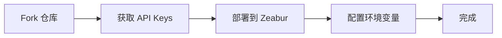

# ⚡ 快速开始指南

5 分钟内完成 Flux Chat AI 的部署！

## 🎯 部署流程



---

## Step 1: Fork 仓库 (1 分钟)

1. 访问 https://github.com/kinai9661/flux-chat-ai
2. 点击右上角 **"Fork"** 按钮
3. Fork 到你的 GitHub 账号

---

## Step 2: 获取 API Keys (2 分钟)

### 选项 A: 快速开始 (仅聊天)

✅ **无需申请，直接使用！**

```env
TYPLI_API_URL=https://fluxes.zeabur.app/v1/chat/completions
```

### 选项 B: 完整功能 (聊天 + 图片)

需要获取 Replicate API Key:

1. 访问 https://replicate.com/signin
2. 用 GitHub 登录
3. 进入 https://replicate.com/account/api-tokens
4. 点击 "Create token"
5. 复制 token (格式: `r8_xxx`)

💰 **新用户送 $5 免费额度！**

---

## Step 3: 部署到 Zeabur (2 分钟)

### 3.1 创建项目

1. 访问 https://zeabur.com
2. 用 GitHub 登录
3. 点击 **"Create Project"**
4. 命名项目 (如 `flux-chat-ai`)

### 3.2 部署服务

1. 点击 **"Deploy New Service"**
2. 选择 **"Deploy from GitHub"**
3. 找到并选择你 Fork 的 `flux-chat-ai` 仓库
4. 选择 `main` 分支
5. 点击 **"Deploy"**

### 3.3 配置环境变量

在 Zeabur 服务页面：

1. 点击 **"Variables"** 标签
2. 添加以下变量：

**最小配置 (仅聊天)**:
```
TYPLI_API_URL = https://fluxes.zeabur.app/v1/chat/completions
```

**完整配置 (聊天 + 图片)**:
```
TYPLI_API_URL = https://fluxes.zeabur.app/v1/chat/completions
FLUX_API_ENDPOINT = https://api.replicate.com/v1/predictions
FLUX_API_KEY = r8_your_key_here
```

3. 点击 **"Save"**
4. Zeabur 会自动重新部署

---

## Step 4: 访问应用 (立即)

1. 等待部署完成 (~2 分钟)
2. 点击 Zeabur 生成的域名
3. 开始使用！

---

## 🎉 完成！

你现在可以：

- 💬 与 AI 聊天
- 🎨 生成 AI 图片 (如果配置了 FLUX API)
- 📚 查看历史记录 (如果添加了数据库)

---

## 可选: 添加数据库 (历史记录功能)

在 Zeabur 项目中：

1. 点击 **"Add Service"**
2. 选择 **"PostgreSQL"**
3. 等待创建完成
4. `POSTGRES_URL` 会自动配置
5. 重新部署应用

---

## 🆘 遇到问题？

### 问题 1: 聊天不工作

**解决方案**: 检查 `TYPLI_API_URL` 环境变量

```env
TYPLI_API_URL=https://fluxes.zeabur.app/v1/chat/completions
```

### 问题 2: 图片生成失败

**解决方案**: 
1. 确认已配置 `FLUX_API_KEY`
2. 检查 API Key 是否有效
3. 确认 Replicate 账户有余额

### 问题 3: 部署失败

**解决方案**: 查看 Zeabur 构建日志

---

## 📚 深入了解

- [完整环境变量指南](../ENV_SETUP.md)
- [API 配置说明](../README.md#api-配置)
- [常见问题](../README.md#常见问题)

---

**准备好了吗？** [开始部署 →](https://zeabur.com)